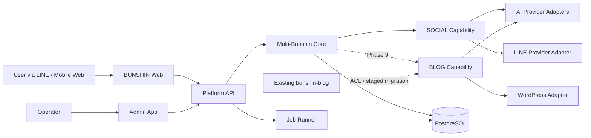
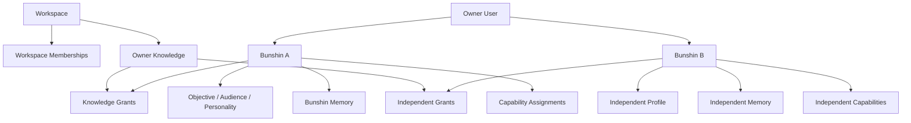
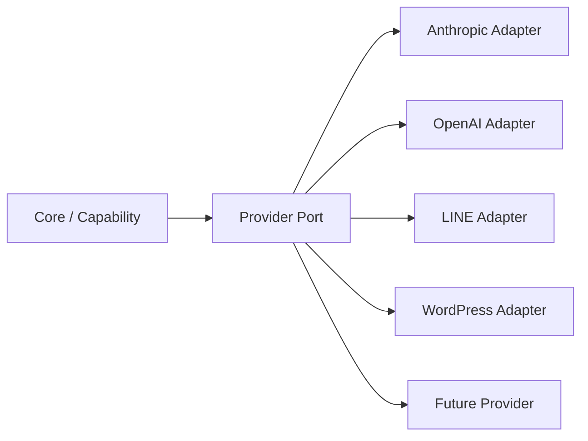
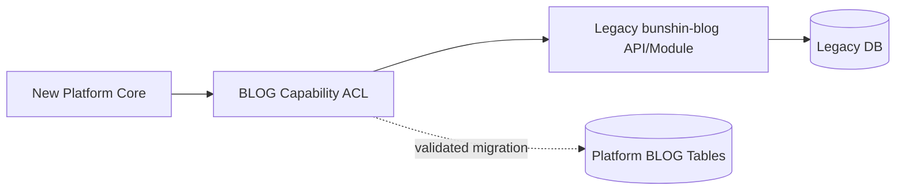

# Target Architecture: BUNSHIN Platform

## 1. Context and Goals

BUNSHIN Platformの中心はUserでもSNSアカウントでもBlogでもなく、Workspace内でUserが所有する複数のBunshinである。各Bunshinは独立した目的、Audience、人格、許可された知識、Memory、Capability、Channel、Mission、Performanceを持つ。

本設計は次を満たす。

- 1 User:N Bunshin
- Workspace/User間およびBunshin間のdata isolation
- SOCIALとBLOGを交換可能なCapabilityとして分離
- AI/LINE/WordPress等をProvider Adapterへ隔離
- 既存`bunshin-blog`を稼働可能な移行元として保持
- 初期MVPのSOCIAL以外を先回り実装しない

## 2. Context図



## 3. Container構成

目標の論理構成は次とする。Phase 1で全packageの実体を作る必要はなく、必要なものだけscaffoldする。

```text
bunshin-platform/
├─ apps/
│  ├─ web/                 Mobile-first Today/Bunshin UI
│  ├─ api/                 HTTP API + authz + application services
│  └─ admin/               Operations UI
├─ packages/
│  ├─ bunshin-core/        Workspace/User/Bunshin/Knowledge/Memory
│  ├─ capability-contract/ Capability port and registry types
│  ├─ capability-social/   SOCIAL domain/application logic
│  ├─ ai/                  AI ports, adapters, schema, usage
│  ├─ line/                LINE ports/adapters
│  ├─ database/            Prisma, repositories, migrations
│  ├─ shared/              errors, validation, datetime, HTTP, crypto
│  └─ observability/       logs, audit, AI/job metrics
├─ prisma/
├─ docs/
└─ tests/
```

`capability-blog`はPhase 9で追加する。Phase 1で空packageを量産せず、Capability ContractにBLOGを将来追加できるtype boundaryだけを用意する。

NestJS採用は必須条件ではない。Phase 1開始前にNext.js Route Handler継続との比較を行い、API/workerの独立deployが必要ならNestJSを選ぶ。domain packageはframework非依存に保つ。

## 4. Multi-Bunshin Domain Boundary



### Aggregate/ownership rules

1. `Workspace`が最上位のdata ownership boundaryである。
2. `User`はactorであり、`Bunshin`は別entityである。
3. すべてのBunshin queryは`workspaceId + ownerUserId + bunshinId`でscopeする。
4. Bunshin配下のMemory/Mission/Performanceは`bunshinId`を必須とする。
5. Owner KnowledgeはWorkspace/Userに属し、`BunshinKnowledgeGrant(ALLOW)`があるものだけAI contextへ入れる。default DENY。
6. Bunshin間のMemory/mission history共有は禁止し、共有が必要な将来機能は明示的なcopy/grant eventとして設計する。

## 5. Owner KnowledgeとBunshin Memory

### Owner Knowledge

本人が管理する再利用可能素材。PROFILE/EXPERIENCE/SKILL/PRODUCT/FAQ/CASE/ASSET/OTHERを持つ。AI context assemblerは次のintersectionだけを返す。

```text
requested workspace
∩ authenticated user's accessible workspace
∩ requested Bunshin ownership
∩ active OwnerKnowledge
∩ explicit ALLOW grant
```

### Bunshin Memory

Bunshin専用の学習結果であり、Owner Knowledgeのmirrorではない。source、confidence、importance、active、provenanceを必須にする。embedding failure時もmemory本体は保存可能とし、検索品質低下をwarningとして残す。

既存`PersonaFact`はBLOG用の検証事実として保持し、次のいずれかを人間が選択したものだけ移行する。

- Bunshin本人の経験・信念 → `BunshinMemory`
- ユーザーが複数Bunshinで使いたい素材 → `OwnerKnowledge` + explicit grants
- 記事固有のfact/evidence → BLOG Capability内に残す

## 6. Capability Contract

CoreはSOCIAL/BLOGのtableやSDK型を知らない。

```ts
export type CapabilityType = 'SOCIAL' | 'BLOG';

export interface CapabilityContext {
  workspaceId: string;
  actorUserId: string;
  bunshinId: string;
  assignmentId: string;
  requestId: string;
}

export interface BunshinCapabilityHandler {
  readonly type: CapabilityType;
  activate(context: CapabilityContext): Promise<void>;
  getStatus(context: CapabilityContext): Promise<CapabilityStatus>;
}
```

追加規則:

- handler実行前にCore serviceがWorkspace/Bunshin ownershipとassignment statusを検証する。
- Capability固有configはassignmentから参照できるが、validation schemaはCapability側が所有する。
- Capability固有tableは`bunshinId`と必要に応じて`workspaceId`を持ち、防御的にscopeする。
- Core transactionと外部Provider side effectを同一transactionとみなさず、outbox/jobまたは明示state transitionを使う。
- Capability未付与/PAUSED/LOCKED時はrouteだけでなくapplication serviceでも拒否する。

## 7. SOCIAL / BLOG境界

| Core                           | SOCIAL Capability          | BLOG Capability        |
| ------------------------------ | -------------------------- | ---------------------- |
| Workspace/User/Bunshin         | SocialProfile              | Blog                   |
| Objective/Audience/Personality | ContentPillar              | WordpressConnection    |
| OwnerKnowledge/Grant           | WeeklyPlan/Item            | ContentPlan/Item       |
| BunshinMemory                  | DailyMission               | ArticleVersion         |
| BunshinCapability assignment   | MissionFeedback/PostRecord | Approval/WordpressPost |
| policy/audit identifiers       | social format schemas      | affiliate/banner/SEO   |

共有してよいのはidentity/context、AI port、job infrastructure、logging、generic errors、明示的なevent contractである。Social `DailyMission`とBlog `ContentItem`、Social feedbackとBlog approvalを同じtableへ統合しない。

## 8. Provider Adapter



AI portは用途を表し、特定SDKを露出しない。

```ts
interface AIProvider {
  generateStructured<T>(input: AIGenerationInput, schema: Schema<T>): Promise<AIResult<T>>;
  embed(texts: string[]): Promise<EmbeddingResult>;
}
```

`AIResult`はprovider/model/promptVersion/token usage/estimated cost/latency/statusを返し、application serviceが`AiGenerationLog`へ記録する。SDK responseやprompt全文をCore entityへ保存しない。

LINE portはlogin verificationとmessagingを分ける。WordPress portはBLOG packageだけから参照する。Canva/SNS publishing/video generationはMVPでadapter実体を作らない。

## 9. Tenant/Data Isolation

### Request authorization pipeline

```text
LINE/Application Session
 → Actor User
 → Workspace Membership
 → Bunshin ownership/access
 → Capability assignment/status
 → Resource belongs to same Bunshin
 → Application service
```

必須実装規則:

- URLの`bunshinId`だけを信用しない。
- repository methodは裸の`id`を受けず、`TenantScope { workspaceId, actorUserId }`と`bunshinId`を受ける。
- `findUnique({id})`で取得後に所有者確認する方式を標準にせず、query条件にscopeを含める。
- 重要な関係は複合FK/unique constraintでも防御する。
- AI context assemblerはBunshin-scoped repositoryだけを利用し、raw Prisma accessを禁止する。
- Admin override/debug accessはreasonを必須にしAuditLogへ記録する。
- Cross User、Cross Workspace、Cross Bunshin、missing Capabilityのintegration testをCI gateにする。

PostgreSQL Row Level Securityは補助防御として検討できるが、Prisma/service roleとの運用をPhase 1で検証してから採用する。RLS採用の有無にかかわらずapplication/repository scopeを省略しない。

## 10. API構成

### Core API

```text
POST /auth/line
GET  /me
GET/POST/PATCH/DELETE /bunshins...
GET/POST /owner-knowledge
POST /bunshins/:bunshinId/knowledge-grants
GET/POST/PATCH/DELETE /bunshins/:bunshinId/memories...
POST /bunshins/:bunshinId/capabilities/:type/activate
```

### SOCIAL API

仕様書11章のmission/profile/history/complete/skip/feedback endpointsを`capability-social` application serviceへrouteする。Route Handlerはvalidation/auth/context assembly/HTTP mappingだけを担当する。

### BLOG API

Phase 9までは既存APIを維持する。新Platform接続後は`/bunshins/:bunshinId/blog/...`配下へfacadeを置き、旧Blog IDを外部へ露出する必要を減らす。旧APIの即時renameはしない。

## 11. Job構成

```text
Scheduler trigger
 → enqueue with unique idempotency key
 → worker claims lease
 → resolve TenantScope + Bunshin + Capability
 → execute handler
 → persist success/failure/usage
 → retry/backoff or dead/manual-review state
```

MVP job:

- `GenerateWeeklyPlanJob`
- `GenerateDailyMissionJob`
- `SendDailyLineNotificationJob`
- `ExpireOldMissionJob`
- `RebuildMissionEmbeddingJob`

idempotencyはDB unique constraintで保証し、application checkだけに依存しない。existing job runnerのlease/backoff/checkpoint patternは再利用候補だが、payloadには`workspaceId`, `bunshinId`, `capabilityType`, `correlationId`を含める。

## 12. DB/module構成

Core tableとCapability tableをschema上で区別する。単一PostgreSQL databaseをMVPの既定とし、別schema/database分割は運用負担が必要になる時点まで行わない。

```text
Core:
  workspaces, users, workspace_memberships
  bunshins, bunshin_objectives, bunshin_audiences, bunshin_personalities
  owner_knowledge, bunshin_knowledge_grants, bunshin_memories
  bunshin_capabilities, audit_logs, ai_generation_logs, jobs

SOCIAL:
  social_profiles, content_pillars
  weekly_plans, weekly_plan_items
  daily_missions, mission_feedback, post_records

BLOG (Phase 9):
  blogs, wordpress_connections, content_plans, content_items
  article_versions, blog_approvals, wordpress_posts
  affiliate_offers, banners, blog_metrics...
```

主要unique/foreign-key:

- `bunshins(owner_user_id, slug)` unique（必要ならworkspaceも含める）
- `bunshin_capabilities(bunshin_id, capability_type)` unique
- `daily_missions(bunshin_id, mission_date)` unique
- `bunshin_knowledge_grants(bunshin_id, owner_knowledge_id)` unique
- child→Bunshinの関係でWorkspace越境を作れない制約を採用

## 13. 既存ブログからの段階移行

### 推奨: Strangler + Anti-Corruption Layer



段階:

1. **Inventory**: 本番User/Persona/Blog/credentials/data volumeとorphanをread-only監査。
2. **Identity mapping**: `legacy_user_id`, `legacy_persona_id`, `legacy_blog_id`と新IDのmappingを確定。
3. **ACL接続**: 新BunshinのBLOG assignmentから旧Blogへ明示mappingし、暗黙検索しない。
4. **Shared extraction**: AI/LINE/job/logger等は新contractを定義してからadapterを移植。
5. **Shadow/read parity**: 同じ入力で所有権・件数・状態が一致することを比較。
6. **Incremental data migration**: entity単位にdry-run、checkpoint、再実行可能なimportを行う。
7. **Cutover**: capability単位/tenant単位で切替え、rollback期間を設ける。
8. **Retirement**: 旧route/table削除はPhase 9完了とdata retention判断後。

代替案:

- **旧DBを直接共有**: 速いがCoreとlegacy schemaが密結合するため非推奨。
- **一括移植/全面rewrite**: 長期停止・検証不能・rollback困難のため非推奨。
- **旧BLOGを永続的な別serviceにする**: isolationは強いが、identity/transaction/運用が二重になる。中期の暫定策としては可。

## 14. Phase 1の具体的範囲

Phase 1で行うこと:

1. package manager/monorepo/framework/deployment decisionをADR化。
2. root workspace、最小の`web`/`api`/`admin`または採用した等価構成をscaffold。
3. strict TypeScript、lint、format、unit/integration test、buildのCIを構成。
4. environment schema、structured logger、common error/validationを導入。
5. PostgreSQL/Prisma接続とmigration workflowを確立。
6. request/correlation IDと最低限のobservability contextを確立。
7. domain packageがframework/Provider SDKへ依存しないdependency ruleをtest/lintで守る。
8. 既存ブログはsubtree移動・DB変更せず、参照元commitを固定する。

Phase 1で行わないこと:

- Bunshin CRUD/Memory/Capabilityの本実装（Phase 2）
- SOCIAL model/UI/AI生成（Phase 3以降）
- LINE daily push（Phase 5）
- BLOG code/data migration（Phase 9）
- SNS自動投稿、動画生成、Canva連携

## 15. Phase 1開始条件 / Human Decisions

Phase 1前に人間が決める必要がある。

1. **Runtime topology**: Next.js一体型を継続するか、NestJS API/workerを分離するか。
2. **Repository/tooling**: pnpm + Turborepoを採用するか。採用時のNode/pnpm version。
3. **Database hosting**: 既存Cloud SQL継続、Supabase、または別PostgreSQL。リージョンと運用責任。
4. **Auth boundary**: PERSONAL Workspace自動作成、Admin identityをWorkspace Userと分けるか。
5. **Legacy coexistence**: 旧BLOGの稼働継続期間、API接続かdata importか、許容停止時間。
6. **Identity migration**: 旧UUID維持かmapping tableか。
7. **Production access**: Phase 9前のread-only data inventoryとcredential migrationを誰が承認/実施するか。
8. **Job infrastructure**: PostgreSQL queueをMVPで再利用するか、managed queueを採用する条件。
9. **Deployment platform**: GCP継続か、apps別のtargetを変えるか。

## 16. Architecture Gate

Phase 1へ進める条件は次のレビュー完了である。

- `CURRENT_SYSTEM_AUDIT.md`の事実関係が既存担当者に確認された。
- `REUSE_MAP.md`のCore/Shared/BLOG分類が承認された。
- Workspace→User→Bunshin→Capabilityの所有境界が承認された。
- Strangler/ACL方式と旧システムの非破壊方針が承認された。
- 上記Human DecisionsのうちPhase 1 scaffoldに影響する項目が決定された。

このGateを越えるまでPhase 1実装、migration、SOCIAL UI、投稿生成、LINE配信を開始しない。
